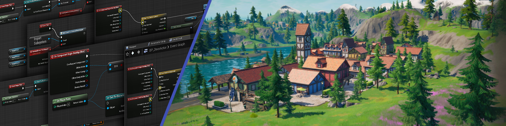

# Unreal Engine 5 API Reference

The **API Reference** is a comprehensive guide to the most prominent classes and functions in Unreal Engine 5. The aim here is to provide a detailed look into the various elements of the engine with examples and explanations, to help you understand how to use them in your projects.
